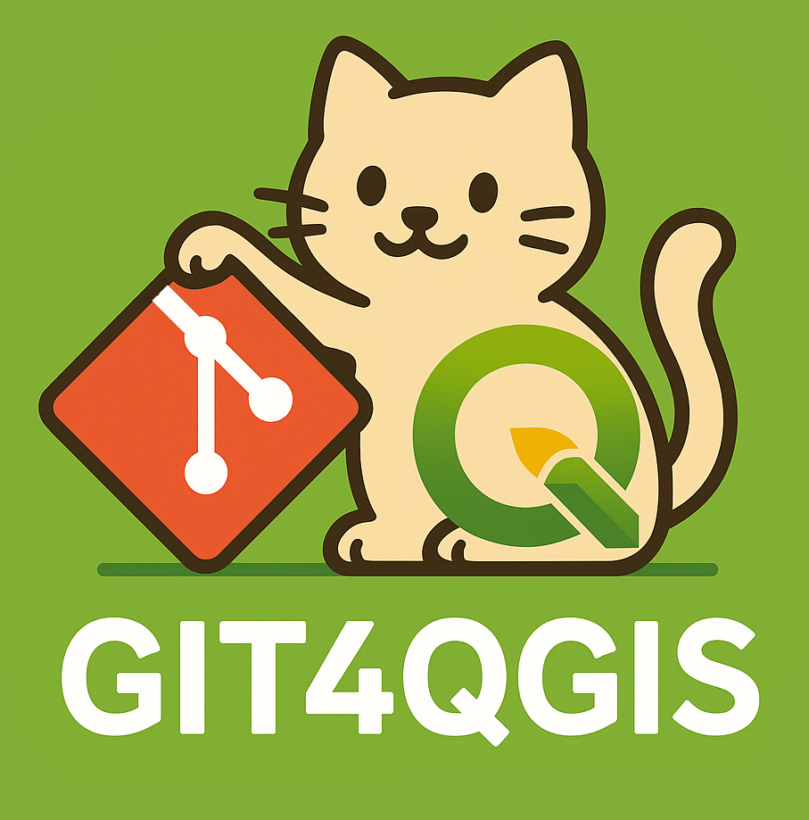

# About

Seamless Git integration for QGIS plugins, automatically updating your plugins from GitHub repositories when QGIS launches. Supports fine-grained personal access tokens for two-factor authentication, and Windows Data Protection API to encrypt the token.

## Requirements
- QGIS 3.x or newer
- Git installed on your system
- GitHub repository with your plugins

## How to

Step 1: Clone this repo into your QGIS python plugins folder (example: C:\OSGeo4W\apps\qgis\python\plugins)

Step 2: Make sure that your QGIS plugins start with a prefix that you set in the settings dialog. This is so that the plugin knows which plugins it should check for in the Github repo. Github repos can consist of either a single plugin (metadata.txt must be in the root), or multiple plugins with metadata.txt in the root of each folder). 

Step 3: Develop your plugins as usual, and push the changes to Github. Make sure that the 'version' variable in the metadata.txt is increased with the changed code, as that is how Git4QGIS detects changes, cloning down the updated repo. 

## Configuration

- **Organization Prefix**: Set the prefix used for all your plugins (e.g., "MyOrg_")
- **GitHub Repository**: URL to your GitHub repository containing the plugins
- **GitHub Authentication**: Username and PAT for private repositories (securely encrypted)
- **Git Executable Path**: Custom path to git.exe (default: C:\Program Files\Git\bin\git.exe)
- **QGIS Plugin Directory**: Custom plugin directory (default: C:\OSGeo4W\apps\qgis\python\plugins)
- **Run on startup**: Enable to automatically check for updates when QGIS launches

## Security
This plugin uses the Windows Data Protection API (DPAPI) to securely encrypt your GitHub token. The token is never stored in plain text and is only decrypted when needed for authentication.
